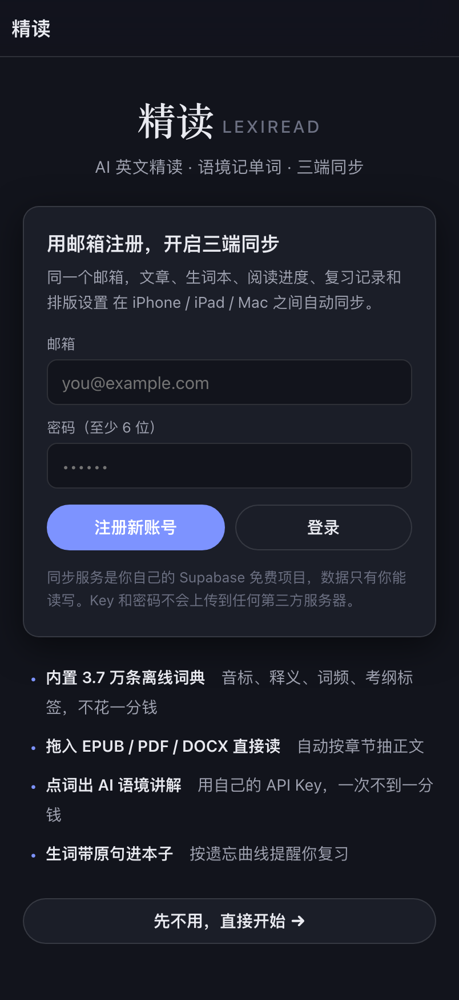
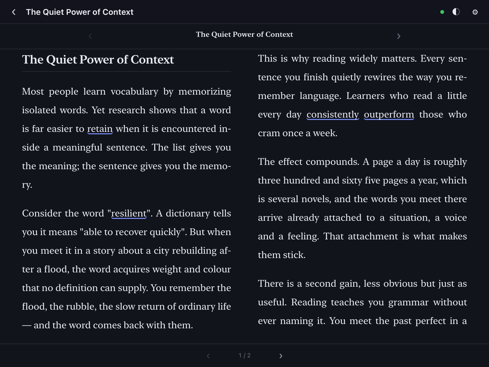
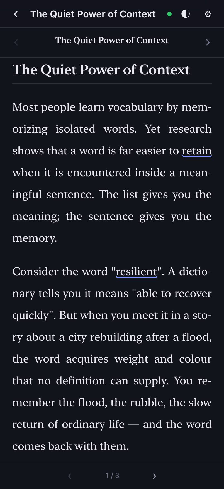
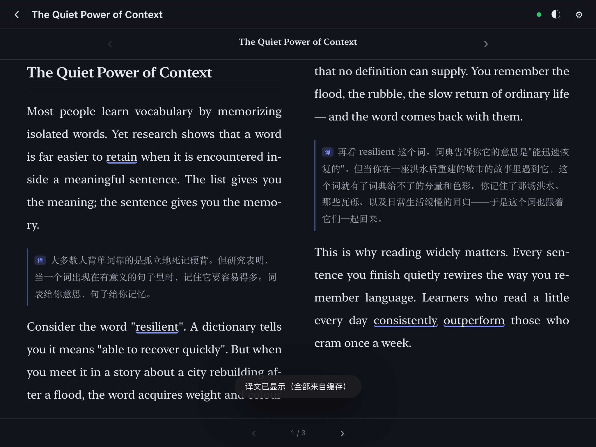
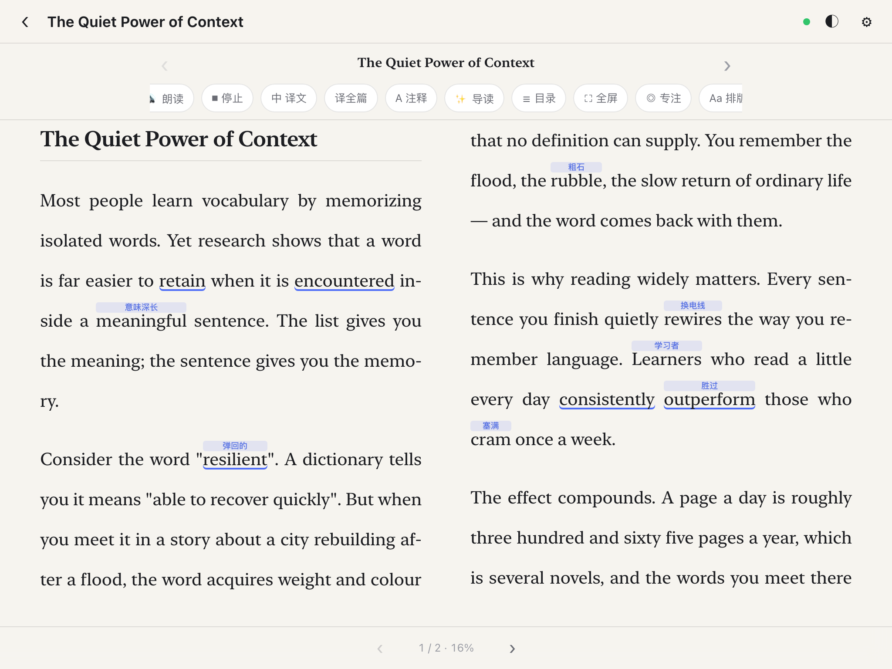

# 精读 LexiRead

一个**自托管的 AI 英文精读 + 语境记单词**应用。它做的事情和 [SentiaRead](https://apps.apple.com/cn/app/sentiaread-%E8%8B%B1%E6%96%87%E9%98%85%E8%AF%BB-%E8%AF%AD%E5%A2%83%E8%AE%B0%E5%8D%95%E8%AF%8D/id6756271685) 基本一样，但**没有订阅、没有服务器、没有账号**——AI 用你自己的 API Key，费用直接算在你自己的账号上。

**一个网址，iPhone / iPad / MacBook 三端通用。**

| 第一屏：邮箱注册 · 三端同步 | 翻页阅读（宽屏两栏，像书一样） |
|---|---|
|  |  |

| 手机上的单栏翻页 | 点词 · AI 语境讲解 | 复习 |
|---|---|---|
|  |  |  |

| **中文对照阅读** | **分级注释：只标难词** | 目录 / 生词本 |
|---|---|---|
|  |  |  |

---

## 它有什么

- **文件直接导入**：EPUB 电子书、PDF 论文报告、Word（.docx）、TXT、Markdown、HTML 都能拖进来。
  EPUB / DOCX 用浏览器内置解压自己解析，PDF 用懒加载的 pdf.js（首次用到才下载，之后离线可用）。
- **登录 + 跨设备同步**：一个邮箱账号，在 iPhone / iPad / Mac 之间自动同步文章、生词本、阅读进度、
  复习记录、排版设置和 AI 讲解缓存。删除也会同步，冲突按时间新的算。
- **点词即查**：内置 36,991 条离线中英词典（来自 [ECDICT](https://github.com/skywind3000/ECDICT)，MIT），音标、词性、中文释义、词频、柯林斯星级、牛津核心、中考/高考/四六级/考研/托福/雅思/GRE 标签，全部离线可用，不花一分钱。
- **词形还原**：点 `running` / `went` / `stopped` / `children` 自动找到原形；屈折形式还会给一个可点的「原形 xxx」跳转。
- **AI 语境讲解**：结合这个词**在句子里**的用法解释——本句释义、为什么是这个意思、其他常用义、同类例句、词根记忆。
- **整句翻译 + 语法拆解**：长难句的主干、成分拆解、难点、地道译文。
- **中文对照阅读**：工具栏「中 译文」**只翻当前这一页** —— 几秒钟出结果，几页的书也不会
  为了看一页而翻整本；**翻到下一页会自动接着翻**。想整本翻就点旁边的「译全篇」
  （长文会先确认花费）。已经翻过的段落全部缓存，**关掉再打开不重复花钱**。
  只想翻一段：点词 →「译本段」，译文**当场出现在面板里**，同时插进正文。
- **语境记单词**：点「＋ 加入生词本」时，**原句和出处一起存下来**，复习时自动变成挖空句。
- **生词本可导出 Anki**：一键导出成制表符分隔文件，Anki、欧路词典都能直接导入。
- **分级注释**：工具栏「A 注释」**连点循环切换**（关闭 → 六级以上 → 考研以上 → 托福/雅思以上），
  或者到设置里选「四级以上 / 六级以上 / 考研以上 / 托福雅思以上 / GRE」，
  文中超过这个难度的词会自动在**头顶标出简短中文释义**（可选带音标），像日文的注音一样。
  难度判定用考纲标签 + 词频 + **完整词形还原**：`is→be`、`words→word`、`easier→easy`、
  `buying→buy`、`intimidating→intimidate` 都会回退到原形判断，只要有一个原形是基础词就不标
  （托福词表里也有 can / in / day，取最高级别会把它们全标上）。
  人名地名等专有名词直接跳过。实际密度约 **2~5%**，只标真正该查的词。
- **章节目录**：工具栏「☰ 目录」列出所有章节，点一下直接跳过去；
  EPUB 的章节标题会被自动识别。
- **按字数算的阅读进度**：页脚显示 `1 / 6 · 16%`，百分比是按**已读词数**算的，不是页数。
- **查词不挡视线**：宽屏下点左半边的词，详情面板出现在**右边**；点右半边，面板出现在**左边**。
  面板是**浮在正文之上**的（不改变正文宽度、不会重排、页码不变），所以阅读位置永远不会丢。
  「译本段」的译文会**当场显示在面板里**，同时插进正文对应段落。
- **AI 配置可选同步**：默认只留在本机；打开设置里的开关后，Base URL / 模型 / API Key
  会随账号同步到你的 iPhone、iPad，不用每台重填（存在你自己的 Supabase 里）。
- **全屏 / 专注**：⛶ 全屏；iPhone 的 Safari 不给网页全屏时会自动退化为「专注模式」。
- **中英双语要点总结**：「✨ 导读」输出【全文主旨】【核心要点】【Key Points】中英各 4 条，
  外加**按意思拆解的【结构拆解】**（不是按自然段分，而是按论点推进分 3~6 个部分，
  每部分有小标题和它在全文里的作用），最后是【难度】【亮点】，可直接复制或「重新生成」。
- **发音更自然**：音色按质量排序（Siri > 增强版/高级版 > 普通 > 紧凑版），
  自动跳过 macOS 的玩具音色；**单个单词读得比整句慢**，音素更清楚。
  设置页会提示怎么在系统里下载更高质量的语音。
- **间隔重复**：SM-2 精简版（忘记 / 模糊 / 记得 / 太简单），按遗忘曲线排期，每个按钮上直接显示下次间隔。
- **朗读**：调用系统语音（iOS/macOS 的 Siri / Samantha 等），可调语速、可换音色，边读边高亮当前句并自动滚动。
- **翻页阅读，像书一样**：不是无限滚动，而是**一页一页翻**——页眉显示书名与当前章节、页脚显示「15 / 78」和左右翻页箭头。
  **宽屏自动排成两栏**（像摊开的书），手机上自动一栏。支持左右滑动、方向键、空格键翻页。
  也可以随时切回滚动模式。
- **纸质书级排版**：两端对齐 + **按音节自动断词**（`mem-orizing`、`dic-tionary`，右边缘齐整又不出现字距河流）、
  标点悬挂、连字（ligature）、字距与字偶距微调、页边距随屏宽自适应。
  段落可选「书籍式」（首行缩进）或「网页式」（段间空行，与 SentiRead 一致）。
- **第一屏就是注册**：打开就先让你用邮箱注册/登录，同一个邮箱在 iPhone / iPad / Mac 自动同步。
  不想注册可以点「先不用」。
- **阅读体验**：字号 / 行距 / 版心 / 字体（衬线 / 无衬线 / 等宽）、明亮 / 纸黄 / 暗色 / 跟系统、专注模式、阅读进度记忆。
- **离线可用**：Service Worker 缓存整个应用 + 词典，装到主屏后断网也能查词、复习。
- **数据全在本机**：文章、生词、AI 结果都存在浏览器 IndexedDB 里，可一键导出 / 导入 JSON 备份。

---

## 快速开始

### 1. 先在本机看一眼（1 分钟）

```bash
cd lexi-read
python3 -m http.server 8777
```

打开 <http://127.0.0.1:8777>。Mac 上就能直接用了。

### 2. 部署到网上，让 iPhone / iPad 也能装（约 2 分钟）

**最省事：双击 [`发布到GitHub.command`](发布到GitHub.command)**

在访达里双击它（首次可能要右键 →「打开」）。它会自动：让你登录一次 GitHub（
验证码直接显示在终端窗口里，当场就能用）→ 建一个公开仓库 → 推代码 → 打开 GitHub Pages →
等它上线并把网址给你、顺手用浏览器打开。全程只要在第一次登录时点一下授权。

> 需要本机有 `curl` 和 `git`（macOS 自带）。没有 `gh` 的话脚本会自动下载一份放在
> `~/Library/Application Support/LexiReadTools`，不动你的系统。

**或者手动来**，任选一种，都不花钱：

#### 方案 A：Netlify Drop（最简单，不用 git、不用装东西）

1. 打开 <https://app.netlify.com/drop>
2. 把整个 `lexi-read` 文件夹拖进去
3. 马上得到一个 `https://xxxx.netlify.app` 网址，完成

#### 方案 B：GitHub Pages（推荐，永久免费，网址稳定）

```bash
cd lexi-read
git init -b main
git add .
git commit -m "精读 LexiRead"
# 在 github.com 上新建一个空仓库，例如 lexi-read，然后：
git remote add origin https://github.com/<你的用户名>/lexi-read.git
git push -u origin main
```

然后在仓库页面：**Settings → Pages → Source 选 `Deploy from a branch` → Branch 选 `main` / `/(root)` → Save**。

等 1 分钟左右，网址是：

```
https://<你的用户名>.github.io/lexi-read/
```

> 应用里所有路径都是相对路径，放在 `用户名.github.io/lexi-read/` 这种子目录下也能正常工作。

> **同步已经预配好了**：`config.js` 里已经填好 Supabase 的 Project URL 与 Publishable key，
> 所以任何设备打开都是「第一屏直接邮箱注册」，不用再手动填。详见下面「跨设备同步」一节。

### 3. 装到三个设备上

> 打开应用第一屏就是**邮箱注册**。同一个邮箱登录后，文章、生词本、阅读进度、复习记录会自动同步
> （前提是已经按下面「跨设备同步」配好了 Supabase）。不想注册就直接点「先不用，直接开始」。

| 设备 | 操作 |
|---|---|
| **iPhone / iPad** | 用 **Safari** 打开上面的网址 → 底部「分享」按钮 → **添加到主屏幕** → 命名「精读」。之后从主屏图标打开就是全屏 App，没有浏览器地址栏。 |
| **MacBook** | 用 **Safari** 打开网址 → 菜单栏 **文件 → 添加到程序坞**。得到一个独立窗口的 App，Dock 里有图标。 |
| 任意电脑（备选） | Chrome / Edge 打开网址 → 地址栏右侧的「安装」图标。 |

> ⚠️ iPhone 上必须用 **Safari** 才能「添加到主屏幕」；用微信/Chrome 打开是装不了的。

### 4. 填上你的 API Key（AI 功能必需）

1. 去 <https://platform.deepseek.com/api_keys> 注册并创建一个 Key（`sk-` 开头）
2. 在应用里点右下角 **设置 → AI 引擎**
3. 接口地址填 `https://api.deepseek.com`，模型填 `deepseek-chat`，粘贴 Key
4. 点 **测试连接**，看到「✅ 连接正常」就成功了

**关于钱**：DeepSeek 现在大概是输入 0.5 元 / 百万 token、输出 8 元 / 百万 token 的量级。点一次词大约消耗 400 token，算下来**一次查询不到 1 分钱**，一个月认真读也花不完几块钱。充 10 块钱能用很久。Key 只保存在你自己的浏览器里，不会经过任何第三方服务器。

> 也支持任何 OpenAI 兼容接口。比如 OpenAI 就把接口地址改成 `https://api.openai.com/v1`，模型改成 `gpt-4o-mini`；Kimi、通义、硅基流动等同理。

---

## 跨设备同步（可选，约 5 分钟配好）

登录功能用 [Supabase](https://supabase.com) 的免费版：真邮箱密码账号 + 数据库 + 行级安全，
不用自己写一行后端代码，也不用信用卡。

### 配置步骤

1. 去 <https://supabase.com> 注册并 **New project**（地区随便选，等 1~2 分钟初始化）
2. 左侧 **SQL Editor → New query**，把建表语句粘进去 → **Run**
   （建表 + 打开行级安全 + 只允许本人读写自己的数据，重复执行也不会报错）
   👉 语句就在 [`docs/supabase.sql`](docs/supabase.sql)；
   **应用里的「账号与同步」区块有一个「📋 复制建表 SQL」按钮，点一下直接复制，不用去找文件。**
3. 左侧 **Project Settings → API**，复制两个值：
   - **Project URL**，形如 `https://abcdefghijk.supabase.co`
   - **anon public** 那个长 key
4. 把这两个值填进 [`config.js`](config.js)：

   ```js
   window.LEXIREAD_CONFIG = {
     supabaseUrl:     'https://abcdefghijk.supabase.co',
     supabaseAnonKey: 'eyJhbGciOi...',
   };
   ```

   然后重新部署一次。这样每台设备打开就自带配置，不用挨个填。

   > 不想改文件也行：直接在每个设备的「设置 → 账号与同步」里粘一次，效果一样。

5. 打开应用 → **设置 → 账号与同步** → 用邮箱注册 / 登录。三部设备登同一个账号即可。

> **重要提示**：Supabase 默认要求验证邮箱，而免费版**内置邮件每小时只能发几封**
> （撞上会报 `email rate limit exceeded`）。私人自用建议直接关掉：
> **Authentication → Sign In / Providers → Email → 把 Confirm email 关掉**。
> 关掉后注册不发邮件、立即生效，也不再受这个限制。
> 如果之前已经建过一个「未验证」的用户，到 **Authentication → Users** 删掉它再重新注册即可。

### 几类已经修掉的典型 bug（都补了回归测试）

| 症状 | 真因 |
|---|---|
| 同步一直失败，提示「登录已过期」 | 推送时**漏了 `user_id`**，被 RLS 全部拒绝（见下） |
| 收藏了生词，正文里却**不画线** | 存的是原形（`run`），文中是变形（`running`），只比对表面形式 |
| **「中 译文」点了没反应** | 翻页模式下工具栏被设成 `opacity:0` 隐藏，iPad 没有 hover，按钮点不到 |
| 分级注释**一个都不显示** | 词典还没加载完时的空结果被写进了缓存，之后永远返回空 |
| `comes` 被解释成「计算机输出缩微胶」 | 词形还原取了第一个候选 `com`（缩写），而不是最常用的 `come` |
| 点带注释的词，面板标题变成 `formidable巨大的` | `textContent` 把 `<rt>` 里的中文注释一起读进去了 |
| 注释把 `buying`、`Learners` 这类简单词也标了 | 这些词的词典条目里没有「（buy 的现在分词）」提示，只靠 lemma 还原不到原形 |

### 一个已被修掉的严重 bug：推送时漏了 `user_id`

数据库的 RLS 策略是 `auth.uid() = user_id`，但客户端推送时**没有带 `user_id`**，
于是所有写入都被拒绝（报 `new row violates row-level security policy`）。

这个 bug 之所以没被测出来，是因为**模拟后端会自动补上 `user_id`，比真实环境宽松**。
现在模拟后端改成和真 Supabase 一样严格校验 `user_id`，这类「客户端漏字段」的错误以后跑测试就能抓到。

### 同步会不会「掉线」？

早期版本有一个真实的坑：同步时会并发发出多个请求，而 access token 恰好过期时，
**这几个请求会同时去刷新令牌**；Supabase 的 refresh token 是一次性轮换的，
并发刷新会把整个令牌族作废，人就莫名其妙被踢下线了。

现在改成了：

- **单飞刷新**（同一时刻只有一个刷新请求）+ 到期前 2 分钟提前续期
- 遇到 401/403 自动刷新并**重试**，不是直接报错
- 网络抖动（Supabase 在境外，国内网络偶尔不稳）会**退避重试 4 次**
- 只有 refresh token 真的失效了才清除会话，并明确提示「请重新登录」

### 同步哪些东西、怎么处理冲突

| 内容 | 同步 | 说明 |
|---|---|---|
| 文章（标题、进度、阅读位置） | ✅ | 只传元数据，很轻 |
| 文章正文 | ✅ | 单独一张表，且只在真的变了时才下载，不会每次同步都拉一遍几 MB 的书 |
| 生词本（含收录时的原句） | ✅ | 复习进度、间隔、评分一起同步 |
| 复习记录 / SM-2 状态 | ✅ | 在手机上复习过，Mac 上不会再让你复习一遍 |
| 排版设置、主题、语速 | ✅ | 冲突时以时间较新的那份为准 |
| AI 讲解缓存 | ✅ | 同步过去可以省第二遍钱 |
| AI 模型 / API Key | ❌ | Key 只留在本机，不上传 |

删除采用「墓碑」标记，所以在一台设备上删掉文章，另一台同步后也会消失，不会复活。

同步是双向合并、按记录时间戳取新的，所以三部设备轮流用不会互相覆盖。
本地改动后约 4 秒自动同步一次；打开应用、从后台切回前台也会自动同步。

---

## 怎么用

1. **导入文章**：点「＋ 导入文章」，粘贴任意英文（支持直接粘贴网页复制的内容，会自动去掉 HTML 标签，也支持 Markdown）。标题留空会自动取第一行。
2. **点任意单词**：弹出面板，先看离线词典的释义，紧接着是 AI 的语境讲解（设置里可以关掉「自动请求」，改成手动点按钮，更省）。
3. **点句子**（点单词之间的空白处）：整句翻译 + 语法拆解。
4. **收藏生词**：面板底部「＋ 加入生词本」，原句一并存下。
5. **复习**：底部「生词本 → 开始复习」。先看词和挖空的原句，想不起来就点「显示答案」，然后按 1/2/3/4 或点按钮评分（电脑上按空格显示答案，1-4 评分）。
6. **朗读**：阅读页顶部「🔊 朗读」，从当前屏幕位置开始读，读到哪句高亮哪句。
7. **备份**：设置 → 导出全部数据，得到一个 JSON 文件；换设备时用「导入数据」恢复。

---

## 项目结构

```
lexi-read/
├── index.html                 单页应用外壳
├── styles.css                 全部样式（含桌面/移动两套布局）
├── sw.js                      Service Worker：外壳 stale-while-revalidate，词典 cache-first
├── manifest.webmanifest       PWA 清单
├── src/
│   ├── app.js                 主程序：路由、阅读器、面板、生词本、复习、设置
│   ├── db.js                  IndexedDB 极简封装
│   ├── dict.js                离线词典 + 词形还原（不规则表 + 规则剥离）
│   ├── ai.js                  DeepSeek/OpenAI 流式调用、提示词、结果缓存
│   ├── srs.js                 SM-2 间隔重复
│   ├── tts.js                 Web Speech 朗读封装
│   ├── text.js                文章解析：段落 / 句子 / 分词
│   ├── importers.js           EPUB / PDF / DOCX / TXT / HTML 解析
│   ├── unzip.js               极简 ZIP 读取（EPUB/DOCX 用，基于 DecompressionStream）
│   ├── sync.js                账号与跨设备同步（Supabase）
│   └── ui.js                  通用 UI 工具
├── config.js                  部署配置（填 Supabase 地址，可留空）
├── data/dict.json             离线词典 36,991 条（2.9 MB，gzip 后 1.3 MB）
├── vendor/pdfjs/              pdf.js（只在导入 PDF 时才加载）
├── icons/                     应用图标
├── scripts/
│   ├── build_dict.py          从 ECDICT 生成精简词典
│   ├── make_icons.py          生成图标
│   ├── make_fixtures.py       生成 EPUB/DOCX/PDF 测试样张
│   ├── browser_test.py        无头浏览器测试运行器（含 AI 与 Supabase mock）
│   └── shoot.py               CDP 精确截图
└── tests/
    ├── nocache.html           截图/调试用：注销 Service Worker 与清缓存
    ├── smoke.html             28 项单元测试（解析 / 词典 / 词形还原 / 间隔重复 / IndexedDB）
    ├── ai.html                11 项 AI 客户端兼容测试（/v1 自动探测、非流式、各种坏网关）
    ├── import.html            11 项文件导入测试（EPUB / DOCX / 两种 PDF / GBK 编码）
    ├── migrate.html            5 项数据库 v1→v2 迁移测试
    ├── e2e.html               43 项端到端 UI 测试（含 AI 流式、中文对照、注释开关、面板浮层、Service Worker 离线）
    ├── stress.html             6 项大文件压力测试（60 万词的书）
    ├── sync.html              21 项跨设备同步测试（真·两个浏览器源）
    ├── device.html            测试用的「设备」桥（postMessage 远程指挥）
    └── seed.html              预置演示数据
```

零依赖、零构建步骤——改完源码刷新页面就生效，没有 `npm install` 也没有打包。

---

## 开发与测试

```bash
# 单元测试 + 端到端测试（会自己起服务器、拉无头 Chrome、把结果 POST 回来）
python3 scripts/browser_test.py /tests/smoke.html --wait 60
python3 scripts/browser_test.py /tests/e2e.html   --wait 110

# 截图（先播种演示数据，再截图）
python3 scripts/browser_test.py /tests/seed.html --wait 40 --profile /tmp/lexi-shot-profile
python3 -m http.server 8791 &          # shoot.py 默认从 8791 取
python3 scripts/shoot.py
```

一共 **127 项测试**，跑法是：

```bash
for t in smoke ai import migrate e2e stress sync; do
  python3 scripts/browser_test.py /tests/$t.html --wait 240
done
```

覆盖的关键路径：

- **文件导入**：EPUB 按 spine 顺序抽正文、DOCX 抽段落、PDF 两种（手写标准字体 + cupsfilter 真实排版）文本提取、GBK 编码回退、损坏文件和不支持格式的中文提示
- **压缩包解析**：自己实现的 ZIP 读取器（STORED + DEFLATE 两种压缩方式）
- **AI**：流式返回、请求体（模型名 / 流式开关 / 提示词含目标词与原句）、缓存命中不重复扣费、Key 无效时的报错引导
- **AI 客户端兼容性**：接口地址少写 `/v1` 时自动改用正确地址、网关忽略 `stream` 返回整段 JSON、SSE 被当成 `text/plain` 返回、401/200 无正文/完全是网页 等情况的明确提示
- **中文对照翻译**：打开译文后逐段翻译并插入、关掉再打开全部走缓存不重复请求、点词面板「译本段」可用
- **同步健壮性**：注册/登录常见报错（邮件限流、邮箱未验证）都翻译成中文并给出可操作步骤
- **跨设备同步**：用两个不同的浏览器源当两台真设备 —— 注册登录、推送、拉取、正文增量下载、双向同步、删除传播、设置冲突取新、以及两条安全断言（无凭证读不到、换账号读不到别人的）
- **大文件**：60 万词的整本书，验证懒渲染（DOM 节点 64.9 万 → 1.1 万）
- **数据迁移**：v1 结构升级到 v2 后文章和生词本都不丢

### 重新生成词典

```bash
curl -L -o build/ecdict.csv https://raw.githubusercontent.com/skywind3000/ECDICT/master/ecdict.csv
python3 scripts/build_dict.py build/ecdict.csv data/dict.json
```

脚本会按 COCA/BNC 词频、柯林斯星级、牛津核心、各类考试标签筛选，并清掉 `[网络]` 这类噪声释义。想要更大的词库，改 `scripts/build_dict.py` 里的 `RANK_LIMIT` / `HARD_CAP` 即可。

---

## 分享给别人用

**可以，这个应用就是设计成随便分享的。** 三种方式：

### 方式一：直接把网址给别人（最省事）

把 `https://你的用户名.github.io/lexi-read/` 发给对方就行。对方用 Safari 打开 →
分享 →「添加到主屏幕」，就是完整的 App。

- 对方要**填自己的 DeepSeek API Key**（设置 → AI 引擎）。**AI 花的钱算在他自己账上，不花你的。**
- 每个人的文章、生词、进度都只存在**自己设备的浏览器里**，互相看不见。
- ⚠️ 如果你把填了 Supabase 的 `config.js` 一起部署了，别人也能在你这个 Supabase 项目里注册。
  数据是互相隔离的（行级安全挡着），但会占你的免费额度。想避免就把分享版本的 `config.js`
  留空（对方用不了云同步，其它功能照常），或者让朋友用方式二。

### 方式二：让对方 Fork 一份自己的（推荐给认真用的朋友）

1. 对方在仓库页面点右上角 **Fork**
2. 在**他自己**的仓库里：**Settings → Pages → Source 选 `main` / `(root)` → Save**
3. 对方得到自己的网址、自己的数据库，完全独立

如果对方也用 `发布到GitHub.command`，它会直接问仓库名并自动建库、推代码、开 Pages，
连 Fork 都不用。

### 方式三：打包成文件发过去

整个文件夹就是一个静态网站。压缩后发给对方，对方双击 `发布到GitHub.command`，
或把文件夹拖到 <https://app.netlify.com/drop>，就有自己的一份。

> **千万别**把 API Key 写进 `config.js` 再上传 —— 那个文件是公开的。
> Key 永远只填在应用界面里（存在浏览器本地，不进仓库）。

---

## 常见问题

**为什么是网页 App，不是 App Store 里的原生 App？**
原生 iOS 应用必须用 Xcode 打包、用 Apple 开发者账号签名（免费账号签的应用 7 天就过期，要重装）。这台 Mac 上只装了 Command Line Tools，没有 Xcode。而 PWA 一次做好、三端通用、可以离线、能装到主屏全屏运行，还不用等审核。代价是没有「分享菜单里直接调用」这类系统级集成（不过文件可以直接在应用里选，iOS 上会读「文件」App 和 iCloud 云盘）。
另外 iOS 的 PWA 不支持把 PDF 从别的 App「分享到」它，得先在应用里点导入再选文件。

**断网还能用吗？**
可以。第一次用某个功能时会被 Service Worker 缓存下来，之后离线也能打开、查词、复习。只有 AI 讲解和「从网址导入」需要联网。

**我的数据存在哪？会不会泄露？**
文章、生词、阅读进度、AI 结果全部存在你设备本机的 IndexedDB 里，没有任何后端。API Key 存在 localStorage，请求直接从你的浏览器发往你填的那个接口地址。唯一的例外是「从网址导入」，它会经过 `r.jina.ai` 去抓取网页正文。

**换设备怎么同步？**
配好 Supabase（见上面「跨设备同步」）之后登录同一个账号就自动同步了。
不想用云也可以：设置 → 导出全部数据 → 在新设备「导入数据」。

**同步要花钱吗？**
不要。Supabase 免费版给 500 MB 数据库和无限账号，纯文字的文章和生词本远远用不完。
数据只有你自己能读写（脚本里开了行级安全，anon key 是公开密钥，放在前端是安全的）。

**能用来学别的语言吗？**
词典是英中的，TTS 也默认英语，所以主要是英语。但 AI 讲解的提示词在 `src/ai.js` 里，改成别的语言对也不难。

**填了 Key、测试连接也「正常」，但点词总说「AI 没有返回内容」？**
多半是**接口地址少写了 `/v1`**。很多第三方网关（New API / One API 这类）在地址写错时不会报错，
而是「友好地」返回一个 200 + 一个网页 —— 旧版本会把网页当数据解析，最后只报「没有内容」。
现在应用会**自动再试一次加 `/v1` 的地址**，并且真的遇到网页会明确告诉你。

各家的正确写法：

| 服务 | 接口地址 |
|---|---|
| DeepSeek 官方 | `https://api.deepseek.com`（有没有 `/v1` 都行） |
| OpenAI | `https://api.openai.com/v1` |
| 第三方网关 | `https://你的域名/v1` ← **注意结尾的 `/v1`** |
| 本机 Ollama | `http://localhost:11434/v1` |

**AI 讲解重复扣费吗？**
不。同一个词在同一句话里的结果会缓存到本机，第二次打开直接读缓存，不再请求接口。测试里有专门一项验证这一点。

---

## 许可与致谢

- 词典数据来自 [ECDICT](https://github.com/skywind3000/ECDICT)（MIT License）
- 应用代码可自由使用、修改、分发
