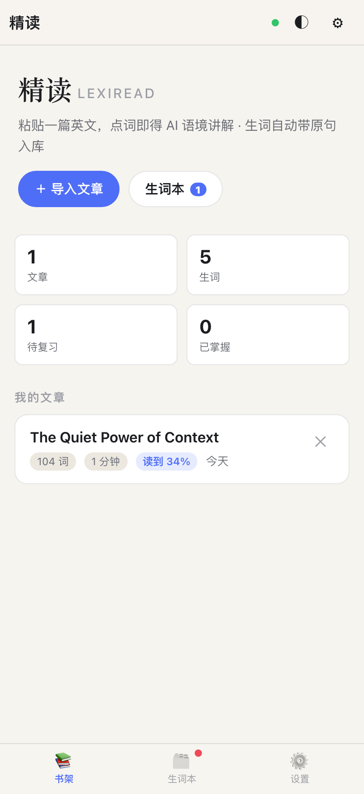
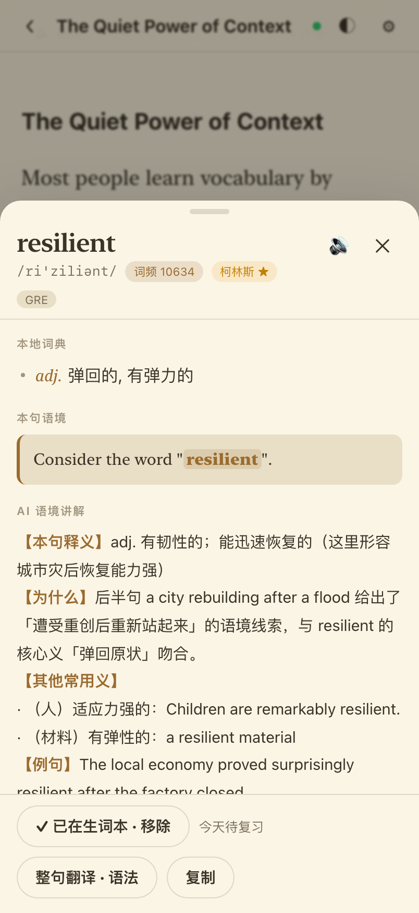
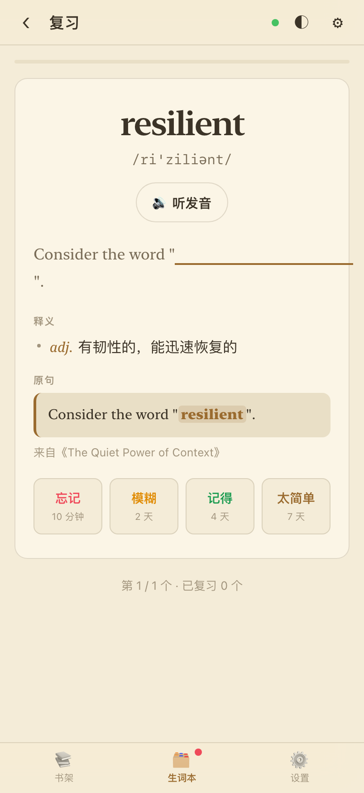
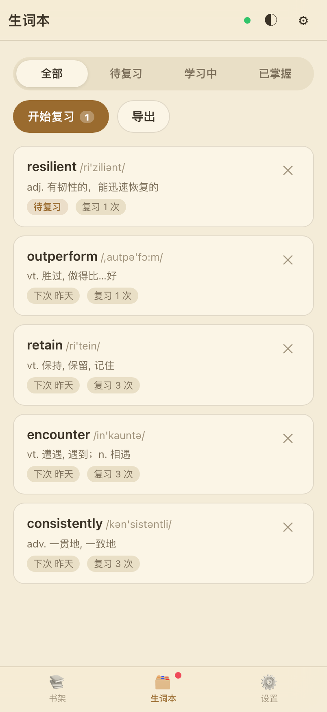
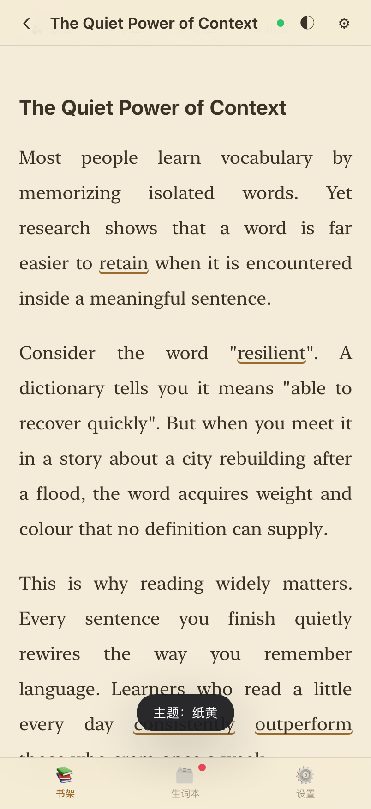
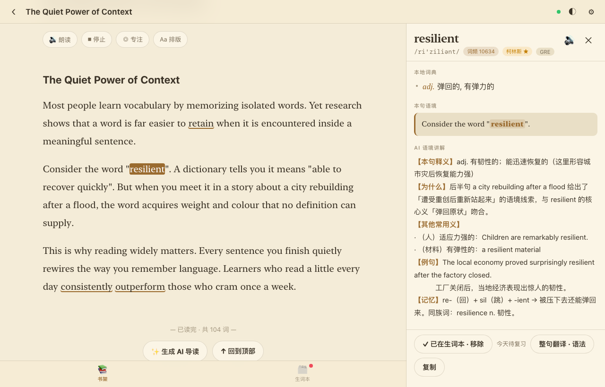

# 精读 LexiRead

一个**自托管的 AI 英文精读 + 语境记单词**应用。它做的事情和 [SentiaRead](https://apps.apple.com/cn/app/sentiaread-%E8%8B%B1%E6%96%87%E9%98%85%E8%AF%BB-%E8%AF%AD%E5%A2%83%E8%AE%B0%E5%8D%95%E8%AF%8D/id6756271685) 基本一样，但**没有订阅、没有服务器、没有账号**——AI 用你自己的 API Key，费用直接算在你自己的账号上。

**一个网址，iPhone / iPad / MacBook 三端通用。**

| 书架 | 点词 · AI 语境讲解 | 复习 |
|---|---|---|
|  |  |  |

| 生词本 | 暗色阅读 | Mac 桌面（侧栏） |
|---|---|---|
|  |  |  |

---

## 它有什么

- **点词即查**：内置 36,991 条离线中英词典（来自 [ECDICT](https://github.com/skywind3000/ECDICT)，MIT），音标、词性、中文释义、词频、柯林斯星级、牛津核心、中考/高考/四六级/考研/托福/雅思/GRE 标签，全部离线可用，不花一分钱。
- **词形还原**：点 `running` / `went` / `stopped` / `children` 自动找到原形；屈折形式还会给一个可点的「原形 xxx」跳转。
- **AI 语境讲解**：结合这个词**在句子里**的用法解释——本句释义、为什么是这个意思、其他常用义、同类例句、词根记忆。
- **整句翻译 + 语法拆解**：长难句的主干、成分拆解、难点、地道译文。
- **语境记单词**：点「＋ 加入生词本」时，**原句和出处一起存下来**，复习时自动变成挖空句。
- **间隔重复**：SM-2 精简版（忘记 / 模糊 / 记得 / 太简单），按遗忘曲线排期，每个按钮上直接显示下次间隔。
- **朗读**：调用系统语音（iOS/macOS 的 Siri / Samantha 等），可调语速、可换音色，边读边高亮当前句并自动滚动。
- **阅读体验**：字号 / 行距 / 版心 / 字体（衬线 / 无衬线 / 等宽）、明亮 / 纸黄 / 暗色 / 跟系统、专注模式、阅读进度记忆。
- **离线可用**：Service Worker 缓存整个应用 + 词典，装到主屏后断网也能查词、复习。
- **数据全在本机**：文章、生词、AI 结果都存在浏览器 IndexedDB 里，可一键导出 / 导入 JSON 备份。

---

## 快速开始

### 1. 先在本机看一眼（1 分钟）

```bash
cd lexi-read
python3 -m http.server 8777
```

打开 <http://127.0.0.1:8777>。Mac 上就能直接用了。

### 2. 部署到网上，让 iPhone / iPad 也能装（约 5 分钟）

任选一种，都不花钱：

#### 方案 A：Netlify Drop（最简单，不用 git、不用装东西）

1. 打开 <https://app.netlify.com/drop>
2. 把整个 `lexi-read` 文件夹拖进去
3. 马上得到一个 `https://xxxx.netlify.app` 网址，完成

#### 方案 B：GitHub Pages（推荐，永久免费，网址稳定）

```bash
cd lexi-read
git init -b main
git add .
git commit -m "精读 LexiRead"
# 在 github.com 上新建一个空仓库，例如 lexi-read，然后：
git remote add origin https://github.com/<你的用户名>/lexi-read.git
git push -u origin main
```

然后在仓库页面：**Settings → Pages → Source 选 `Deploy from a branch` → Branch 选 `main` / `/(root)` → Save**。

等 1 分钟左右，网址是：

```
https://<你的用户名>.github.io/lexi-read/
```

> 应用里所有路径都是相对路径，放在 `用户名.github.io/lexi-read/` 这种子目录下也能正常工作。

### 3. 装到三个设备上

| 设备 | 操作 |
|---|---|
| **iPhone / iPad** | 用 **Safari** 打开上面的网址 → 底部「分享」按钮 → **添加到主屏幕** → 命名「精读」。之后从主屏图标打开就是全屏 App，没有浏览器地址栏。 |
| **MacBook** | 用 **Safari** 打开网址 → 菜单栏 **文件 → 添加到程序坞**。得到一个独立窗口的 App，Dock 里有图标。 |
| 任意电脑（备选） | Chrome / Edge 打开网址 → 地址栏右侧的「安装」图标。 |

> ⚠️ iPhone 上必须用 **Safari** 才能「添加到主屏幕」；用微信/Chrome 打开是装不了的。

### 4. 填上你的 API Key（AI 功能必需）

1. 去 <https://platform.deepseek.com/api_keys> 注册并创建一个 Key（`sk-` 开头）
2. 在应用里点右下角 **设置 → AI 引擎**
3. 接口地址填 `https://api.deepseek.com`，模型填 `deepseek-chat`，粘贴 Key
4. 点 **测试连接**，看到「✅ 连接正常」就成功了

**关于钱**：DeepSeek 现在大概是输入 0.5 元 / 百万 token、输出 8 元 / 百万 token 的量级。点一次词大约消耗 400 token，算下来**一次查询不到 1 分钱**，一个月认真读也花不完几块钱。充 10 块钱能用很久。Key 只保存在你自己的浏览器里，不会经过任何第三方服务器。

> 也支持任何 OpenAI 兼容接口。比如 OpenAI 就把接口地址改成 `https://api.openai.com/v1`，模型改成 `gpt-4o-mini`；Kimi、通义、硅基流动等同理。

---

## 怎么用

1. **导入文章**：点「＋ 导入文章」，粘贴任意英文（支持直接粘贴网页复制的内容，会自动去掉 HTML 标签，也支持 Markdown）。标题留空会自动取第一行。
2. **点任意单词**：弹出面板，先看离线词典的释义，紧接着是 AI 的语境讲解（设置里可以关掉「自动请求」，改成手动点按钮，更省）。
3. **点句子**（点单词之间的空白处）：整句翻译 + 语法拆解。
4. **收藏生词**：面板底部「＋ 加入生词本」，原句一并存下。
5. **复习**：底部「生词本 → 开始复习」。先看词和挖空的原句，想不起来就点「显示答案」，然后按 1/2/3/4 或点按钮评分（电脑上按空格显示答案，1-4 评分）。
6. **朗读**：阅读页顶部「🔊 朗读」，从当前屏幕位置开始读，读到哪句高亮哪句。
7. **备份**：设置 → 导出全部数据，得到一个 JSON 文件；换设备时用「导入数据」恢复。

---

## 项目结构

```
lexi-read/
├── index.html                 单页应用外壳
├── styles.css                 全部样式（含桌面/移动两套布局）
├── sw.js                      Service Worker：外壳 stale-while-revalidate，词典 cache-first
├── manifest.webmanifest       PWA 清单
├── src/
│   ├── app.js                 主程序：路由、阅读器、面板、生词本、复习、设置
│   ├── db.js                  IndexedDB 极简封装
│   ├── dict.js                离线词典 + 词形还原（不规则表 + 规则剥离）
│   ├── ai.js                  DeepSeek/OpenAI 流式调用、提示词、结果缓存
│   ├── srs.js                 SM-2 间隔重复
│   ├── tts.js                 Web Speech 朗读封装
│   ├── text.js                文章解析：段落 / 句子 / 分词
│   └── ui.js                  通用 UI 工具
├── data/dict.json             离线词典 36,991 条（2.9 MB，gzip 后 1.3 MB）
├── icons/                     应用图标
├── scripts/
│   ├── build_dict.py          从 ECDICT 生成精简词典
│   ├── make_icons.py          生成图标
│   ├── browser_test.py        无头浏览器测试运行器（含 AI mock 接口）
│   └── shoot.py               CDP 精确截图
└── tests/
    ├── smoke.html             27 项单元测试
    ├── e2e.html               22 项端到端 UI 测试
    └── seed.html              预置演示数据
```

零依赖、零构建步骤——改完源码刷新页面就生效，没有 `npm install` 也没有打包。

---

## 开发与测试

```bash
# 单元测试 + 端到端测试（会自己起服务器、拉无头 Chrome、把结果 POST 回来）
python3 scripts/browser_test.py /tests/smoke.html --wait 60
python3 scripts/browser_test.py /tests/e2e.html   --wait 110

# 截图（先播种演示数据，再截图）
python3 scripts/browser_test.py /tests/seed.html --wait 40 --profile /tmp/lexi-shot-profile
python3 -m http.server 8791 &          # shoot.py 默认从 8791 取
python3 scripts/shoot.py
```

端到端测试覆盖了：导入文章 → 点词 → 离线释义 → 收藏 → 复习评分 → 排版/主题持久化 → 刷新后数据仍在，以及 **AI 流式返回、请求体正确性、缓存命中不重复扣费、Key 无效时的报错引导**。

### 重新生成词典

```bash
curl -L -o build/ecdict.csv https://raw.githubusercontent.com/skywind3000/ECDICT/master/ecdict.csv
python3 scripts/build_dict.py build/ecdict.csv data/dict.json
```

脚本会按 COCA/BNC 词频、柯林斯星级、牛津核心、各类考试标签筛选，并清掉 `[网络]` 这类噪声释义。想要更大的词库，改 `scripts/build_dict.py` 里的 `RANK_LIMIT` / `HARD_CAP` 即可。

---

## 常见问题

**为什么是网页 App，不是 App Store 里的原生 App？**
原生 iOS 应用必须用 Xcode 打包、用 Apple 开发者账号签名（免费账号签的应用 7 天就过期，要重装）。这台 Mac 上只装了 Command Line Tools，没有 Xcode。而 PWA 一次做好、三端通用、可以离线、能装到主屏全屏运行，还不用等审核。代价是没有「分享菜单里直接调用」这类系统级集成。

**断网还能用吗？**
可以。第一次用某个功能时会被 Service Worker 缓存下来，之后离线也能打开、查词、复习。只有 AI 讲解和「从网址导入」需要联网。

**我的数据存在哪？会不会泄露？**
文章、生词、阅读进度、AI 结果全部存在你设备本机的 IndexedDB 里，没有任何后端。API Key 存在 localStorage，请求直接从你的浏览器发往你填的那个接口地址。唯一的例外是「从网址导入」，它会经过 `r.jina.ai` 去抓取网页正文。

**换设备怎么同步？**
设置 → 导出全部数据，得到一个 JSON；在新设备上「导入数据」。没有自动云同步（那需要服务器）。

**能用来学别的语言吗？**
词典是英中的，TTS 也默认英语，所以主要是英语。但 AI 讲解的提示词在 `src/ai.js` 里，改成别的语言对也不难。

**AI 讲解重复扣费吗？**
不。同一个词在同一句话里的结果会缓存到本机，第二次打开直接读缓存，不再请求接口。测试里有专门一项验证这一点。

---

## 许可与致谢

- 词典数据来自 [ECDICT](https://github.com/skywind3000/ECDICT)（MIT License）
- 应用代码可自由使用、修改、分发
